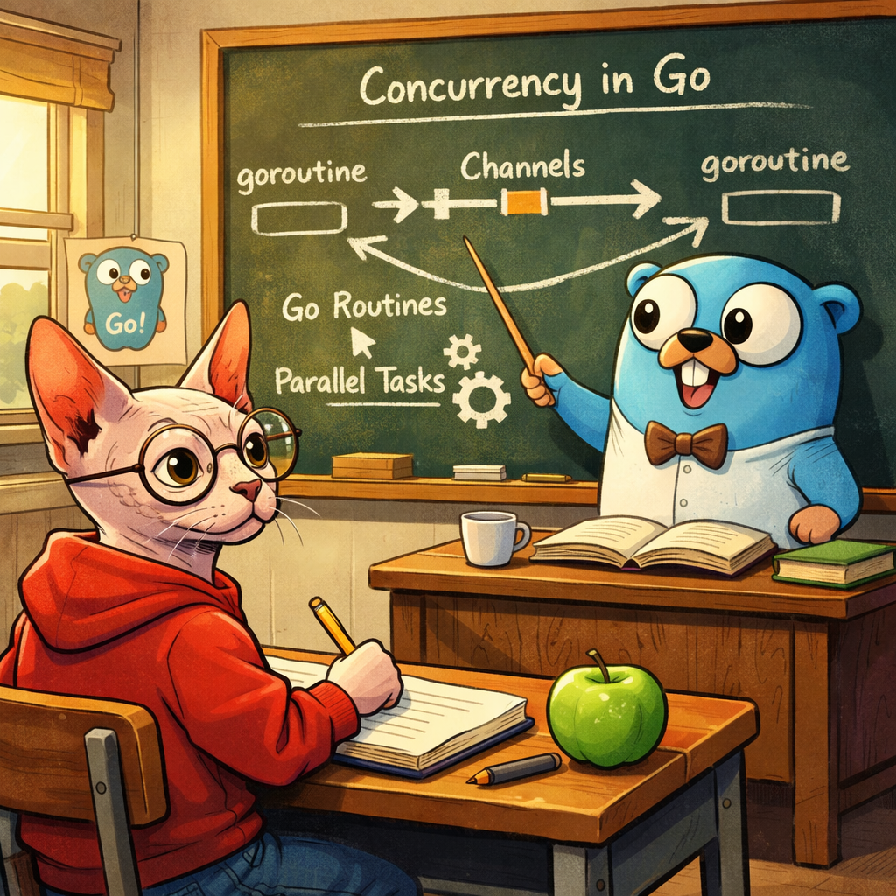

# Go Concurrency Lab



A collection of hands-on Go exercises for learning and practicing concurrency patterns. Each subdirectory is a standalone example or mini-project focused on a specific concept.

## Exercises

| Name | Link | Overview |
|------|------|---------|
| Atomic | [atomic/](atomic/) | Examples using `sync/atomic` for lock-free, thread-safe integer operations |
| Debounce | [debounce/](debounce/) | Debouncer implementation using channels and timed token emission |
| Errgroup | [errgroup/](errgroup/) | Using `golang.org/x/sync/errgroup` to run goroutines, propagate errors, and cancel via context |
| Fan-out / Fan-in | [fan-out-in/](fan-out-in/) | Worker pool pattern distributing jobs across goroutines and collecting results |
| Map + Mutex | [map-mutex/](map-mutex/) | Protecting a shared map with a `sync.Mutex` to prevent concurrent write races |
| Overkill | [overkill/](overkill/) | A concurrent worker-pool FizzBuzz storing results in a `sync.Map` |
| Range (close) | [range/range-close/](range/range-close/) | Demonstrates why closing a channel is required to cleanly `range` over it |
| Range (wait) | [range/range-wait/](range/range-wait/) | Ranging over a buffered channel populated by a goroutine |
| Select (basics) | [select/example/](select/example/) | Non-blocking channel operations using `select` with a `default` case |
| Select (multiread) | [select/multiread/](select/multiread/) | Multiplexing reads from multiple channels with a timeout fallback |
| WaitGroup | [waitforit/](waitforit/) | Basic `sync.WaitGroup` usage to wait for a pool of goroutines to finish |
| Project: Bucket | [project-bucket/](project-bucket/) | Self-contained project implementing a token-bucket rate limiter |
| Project: Bucket + Workers | [project-bucket-worker/](project-bucket-worker/) | Token-bucket rate limiter driving a pool of concurrent workers |
| Project: Crawler | [project-crawler/](project-crawler/) | Observable web crawler combining pipelines, fan-out, rate limiting, and metrics |

## Running an Exercise

Most standalone examples can be run directly:

```bash
cd <directory>
go run .
```

The larger projects under `project-*/` have their own `go.mod` and follow the same pattern.
