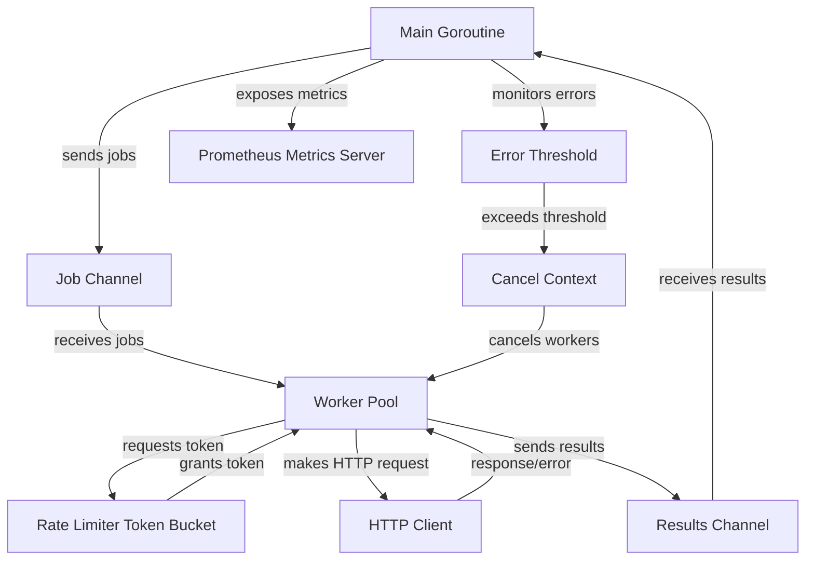

# concurrency-lab

## Overview

An educational Go lab showing practical concurrency patterns by implementing a tiny, observable web crawler. It demonstrates:

- A worker pool with bounded parallelism
- A token-bucket rate limiter shared across workers (requests/second)
- Context-based cancellation and timeouts
- Error threshold “fail fast” behavior using errgroup-like coordination
- Prometheus metrics to observe throughput, latency, bytes read, and success rates

Use it to learn how channels, goroutines, contexts, and backpressure interact in a small but realistic program.

Metrics are exposed while the crawler is running at:
http://localhost:2112/metrics

You’ll see counters and histograms like:
- crawler_requests_total
- crawler_success_total
- crawler_latency_seconds
- crawler_bytes_read

## How to run

You can provide URLs via either:
1) Environment variable URLS (comma-separated)
2) Standard input (piped), one URL per line

Flags (all optional):
- --concurrency: worker pool size (default: 10)
- --rate: requests/second rate limit (default: 10)
- --timeout: per-request timeout (default: 4s)
- --error-threshold: cancel all work after this many worker errors (default: 10)
- --port: metrics server port (default: 2112)

### Windows PowerShell examples

Set URLs via env var (comma-separated):
```powershell
$env:URLS="https://example.com,https://httpbin.org/get,https://httpbin.org/bytes/102400,https://httpbin.org/delay/2"
go run ./cmd/crawler --concurrency 20 --rate 5 --timeout 5s --error-threshold 3
```

Pipe URLs (one per line) using a here-string:
```powershell
@"
https://example.com
https://httpbin.org/get
https://httpbin.org/bytes/102400
https://httpbin.org/delay/2
"@ | go run ./cmd/crawler --concurrency 20 --rate 5 --timeout 5s --error-threshold 3
```

Pipe from a file (urls.txt with one URL per line):
```powershell
Get-Content urls.txt | go run ./cmd/crawler --concurrency 20 --rate 5 --timeout 5s --error-threshold 3
```

Open metrics in a browser while it runs:
```text
http://localhost:2112/metrics
```

### Bash / WSL / Git Bash examples

Env var (comma-separated):
```bash
export URLS="https://example.com,https://httpbin.org/get,https://httpbin.org/bytes/102400,https://httpbin.org/delay/2"
go run ./cmd/crawler --concurrency 20 --rate 5 --timeout 5s --error-threshold 3
```

Pipe newline-separated URLs:
```bash
printf "%s\n" \
	"https://example.com" \
	"https://httpbin.org/get" \
	"https://httpbin.org/bytes/102400" \
	"https://httpbin.org/delay/2" \
| go run ./cmd/crawler --concurrency 20 --rate 5 --timeout 5s --error-threshold 3
```

From a file:
```bash
cat urls.txt | go run ./cmd/crawler --concurrency 20 --rate 5 --timeout 5s --error-threshold 3
```

## Related synchronization concepts

### Token-bucket (leaky-bucket style) rate limiting

We implement a small token-bucket where tokens are added at a steady rate and each request consumes one token. If the bucket is empty, a worker waits. The bucket capacity equals the burst size, allowing short spikes up to that many requests.

- Concept: https://en.wikipedia.org/wiki/Token_bucket
- Go example and discussion: https://pkg.go.dev/golang.org/x/time/rate

### Backpressure

Backpressure means slow consumers can push back on fast producers. In this app:

- The results channel is buffered but finite; if the main goroutine is slow to drain results, workers can briefly buffer but eventually experience pressure.
- The rate limiter limits how quickly work can proceed, preventing overload.
- Jobs are in a channel; once it’s empty, workers naturally idle.

Good intro: todo

### errgroup (coordinated cancellation)

We use errgroup to run workers and a supervisor under a shared context. If any goroutine returns an error (e.g., hitting the error threshold), the group cancels the context and the rest stop promptly. It’s a neat pattern for structured concurrency in Go.

- Package docs: https://pkg.go.dev/golang.org/x/sync/errgroup
- Talk on contexts and cancellation: https://go.dev/blog/context

---

Tip: The crawler exits when all URLs are processed or when the context is canceled (Ctrl+C). Metrics are only served while it’s running.


## diagram

this is an experimental diagram


